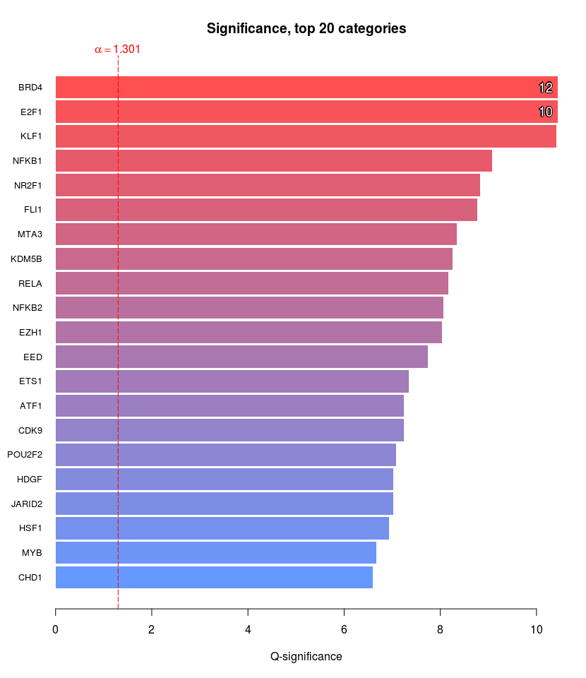
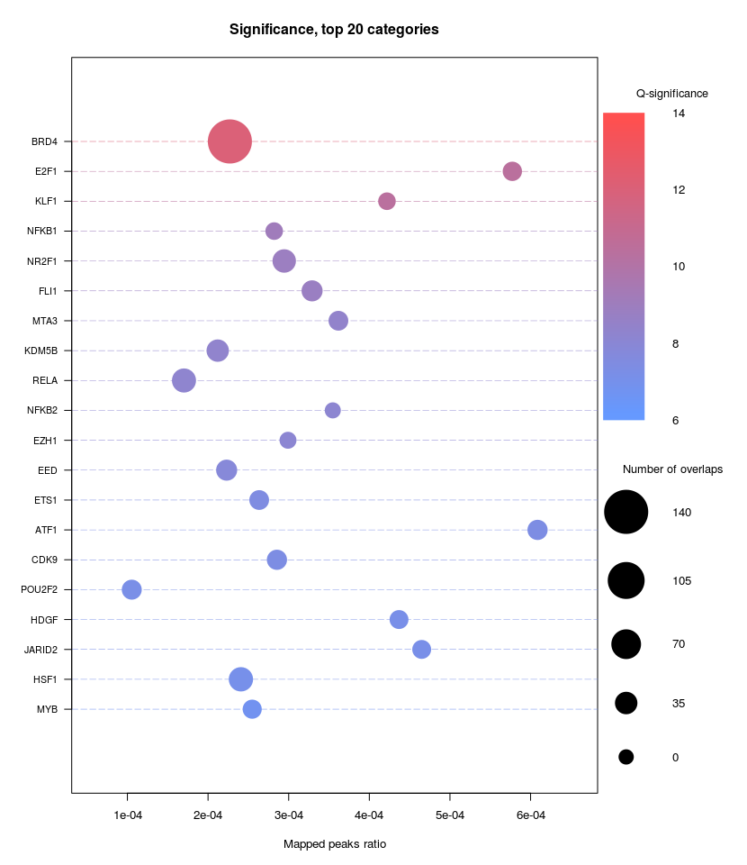
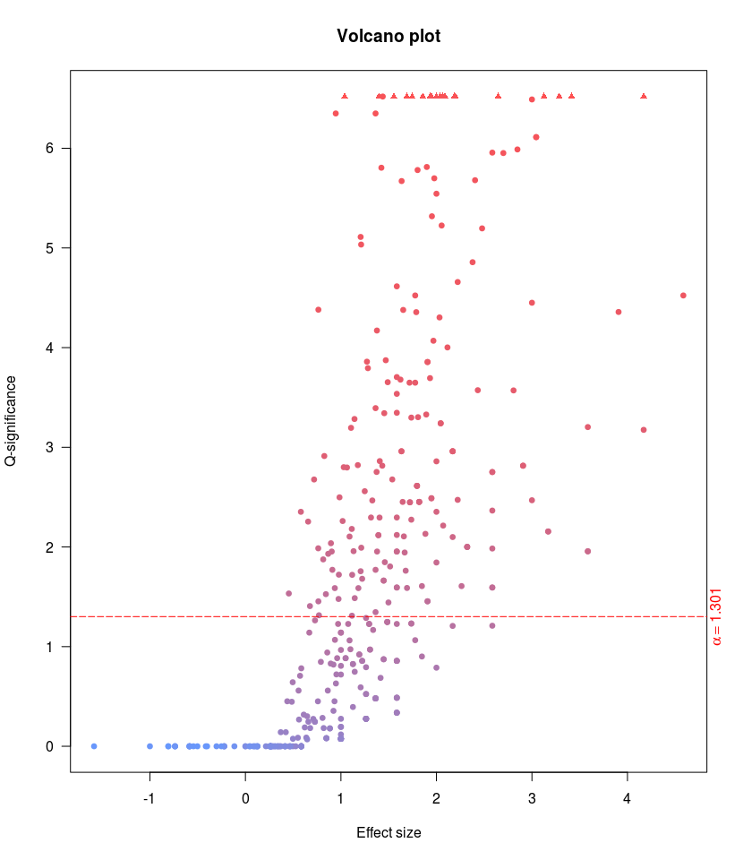
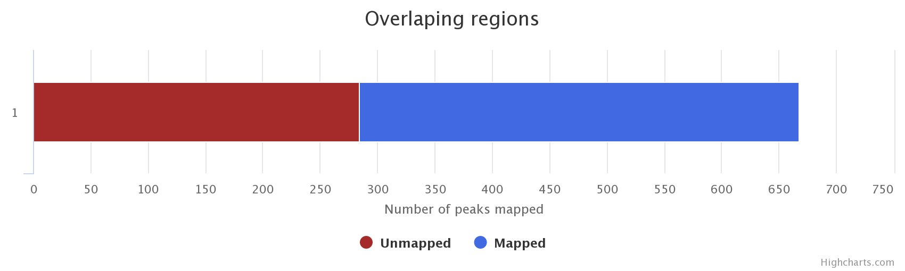
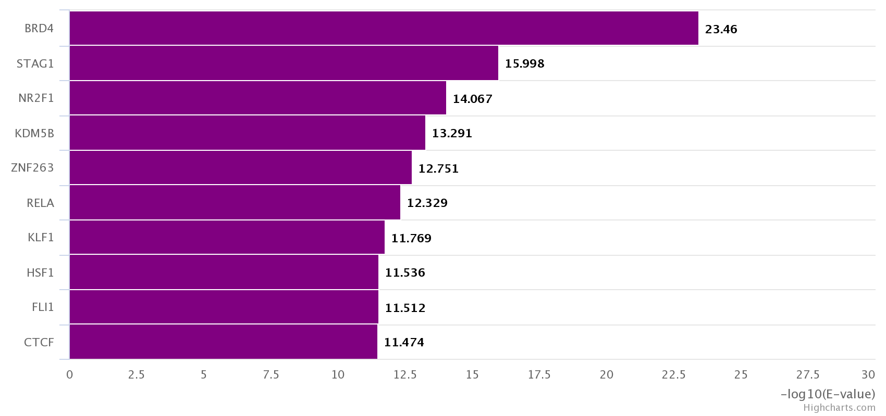

```{r knitr setup, include=FALSE,  eval=TRUE, echo=FALSE, warning=FALSE}
## Global configuration to generate the documents from this Rmd file
library(knitr)
library(RCurl)
library(ggplot2) 
library(gridExtra)
library(cowplot)
library(dplyr) 
library(tidyr)
library(DT)
library(VennDiagram)
library(writexl)
library(stringr)
library(gdata)
library(lubridate)
library(PythonInR)
library(reticulate)
library(haploR)
library(RMySQL)
library(GEOquery)
library(biomaRt)
library(gProfileR)
library(lattice)
library(qqman)
#library(RDAVIDWebService)
```


```{r setup, include=FALSE}
knitr::opts_chunk$set(
  echo=FALSE, 
  eval=TRUE, 
  cache=TRUE, 
  message=FALSE, 
  warning=FALSE, 
  comment = "",  
  fig.align= "center",
  fig.width = 7, 
  fig.height = 5,
  fig.path = "figures/")

## Parameters
parameters <- list(
  update.flowcharts = TRUE, # Update the flowcharts with graphviz dot
  flowchart.formats = c("pdf", "png"), # List of formats to generate
  flowchart.format = "png" # Format for insertion in the report
)
```


```{r configuration, eval=TRUE}
## Main directory
dir.main <- '~/Google\ Drive/These_Yvon_2018/malaria_rsnp'

# Result directory (export result tables)
dir.results <- "results"
dir <- file.path(dir.main, dir.results)
dir.path <- list(disgenet = "disgenet",
                 gwas.2014 = "gwas.2014",
                 gwas.2018 = "gwas.2018",
                 remap ="remap",
                 roken ="roken",
                 disgenet_vs_gwas = "disgenet_vs_gwas",
                 TagSNPs = "TagSNPs",
                 bedtools ="bedtools", 
                 haploreg ="haploreg",
                 gprofiler = "gprofiler",
                 david = "david",
                 biomart = "biomart",
                 phenotype = "phenotype",
                 ucsc = "ucsc",
                 SOIs = "SOIs",
                 SOI_motifs = "SOI_motifs")

for (name in dir.path) {
  dir.create(file.path(dir,name), showWarnings = FALSE, recursive = TRUE)
}

message("Working directory: ", getwd())

#setwd(dir.main)
```

# Goal:

1) Identify the variants potentially associated with malaria.


# Bibliographic search

- Genes associated with malaria resistance.

- Look for rSNPs around these genes.

- Phenotypes studied:

    - Parasitemia
    - Cerebral malaria
    - Respiratory distress
    - Severe anemia


# GWAS rearch

- There are annotations of some symptoms in the GWAS catalog.
- To cross search data of genes / SNPs associated with malaria.


# Search criteria for SNPs

- Number of studies / number of different populations where this variant was detected.
- Functional analyzes of the mutant.


# Flow chart 

```{r generate_flowcharts, eval=TRUE}

message("Updating flowchart figures")
for (flowchart in c("flowchart/gene_wise_approach", "flowchart/snp_wise_approach")) {
  for (format in parameters$flowchart.formats) {
    cmd <- paste(sep="", "dot -T", format, 
                 " ",  flowchart,".dot",
                 " -o ", flowchart, ".", format)
    message("\t", format, "\t", cmd)
    system(cmd)  
  }
}

```

## Gene-wise approach

```{r fig.cap="Flow chart of the gene-wise approach. "}
knitr::include_graphics(paste(sep="", "flowchart/gene_wise_approach.", parameters["flowchart.format"]))
```


## SNP-wise approach

```{r fig.cap="Flow chart of the snp-wise approach. "}
knitr::include_graphics(paste(sep="", "flowchart/snp_wise_approach.", parameters["flowchart.format"]))
```


# Tools of to collect gènes/SNPs cancidats selection

1. DisGenet
	http://www.disgenet.org/web/DisGeNET/menu;jsessionid=1x6jf5ghyr1ga155fxkzfk2iji
	
## Gene associated with malaria from DisGeNet


```{r downloading_GDAs}

## Download gene table from DisGeNet
url <- "http://www.disgenet.org/oql"

## Generate the SQL query for DisGeNet
oql <- "DEFINE
	c0='/data/gene_disease',
	c1='/data/genes',
	c2='/data/diseases',
	c3='/data/gene_disease_summary',
	c4='/data/publication',
	c5='/data/sources'
ON
	'http://www.disgenet.org/web/DisGeNET'
SELECT
	c0 (source, geneId, source, geneId, source, geneId, associationType, originalSource, originalSource, originalSource, sentence, pmid),
	c1 (pantherName, symbol, geneId, description, symbol, geneId),
	c2 (diseaseId, name, hpoName, diseaseId, name, STY, MESH, diseaseClassName, doName, type, OMIM, type),
	c3 (score),
	c4 (year)
FROM
	c0
WHERE
	(
		c2 = 'C0024530'
	AND
		c5 = 'ALL'
	)
ORDER BY
	c3.score DESC" 


dataTsv <- rawToChar(
  charToRaw( 
    getURLContent(url, 
                  readfunction = charToRaw(oql), 
                  upload = TRUE, 
                  customrequest = "POST")))

gene.data <- read.csv(textConnection(dataTsv), header = TRUE, sep="\t")

## Export the full result table
gene.data.file <- "malaria_associated_genes.tsv"
gene.data.path <- file.path(dir.path["disgenet"], gene.data.file)
write.table(x = gene.data,
            file = paste(dir, "disgenet", gene.data.file, sep = "/"), quote = FALSE, sep = "\t", row.names = FALSE, col.names = TRUE)


## Select a subset of fields for display in the report
gene.fields <- c(
  "Gene" = "c1.symbol",
  "Association type" = "c0.associationType",
  "Score" = "c3.score",
  "Disease" = "c2.name",
  PMID = "c0.pmid"
  ) 

## Display a small subset of the table
display.table <- head(gene.data[, gene.fields])
names(display.table) <- names(gene.fields)

kable(display.table)

```

**Gene-wise result table: [`r gene.data.file`](`r gene.data.path`)**


# SNPs collected from different sources

## SNPs from DisGeNet

#### All malaria phenotypes

```{r downloading_VDAs}

## Download SNP table from DisGeNet (All phenotypes)
url <- "http://www.disgenet.org/oql"

## Generate the SQL query for DisGeNet
oql <- "DEFINE
	c0='/data/variant_disease',
	c1='/data/variants',
	c2='/data/diseases',
	c3='/data/variant_disease_summary',
	c4='/data/publication',
	c5='/data/sources'
ON
	'http://www.disgenet.org/web/DisGeNET'
SELECT
	c1 (coord, symbol, geneId, AF_1000G, class, snpId, AF_EXAC, most_severe_consequence),
	c2 (hpoName, diseaseId, name, STY, MESH, diseaseClassName, doName, type, OMIM, diseaseId, name),
	c3 (score),
	c0 (originalSource, sentence, pmid),
	c4 (year)
FROM
	c0
WHERE
	(
		c2 = 'C0024530'
	AND
		c5 = 'ALL'
	)
ORDER BY
	c3.score DESC" 

dataTsv <- rawToChar(charToRaw( getURLContent(url, readfunction =charToRaw(oql), upload = TRUE, customrequest = "POST")))
snp.data <- read.csv(textConnection(dataTsv), header = TRUE, sep="\t")

## Export the full result table
snp.data.file <- "malaria_associated_snps.tsv"
snp.data.path <- file.path(dir.path["disgenet"], snp.data.file)
write.table(x = snp.data,
            file = paste(dir, "disgenet", snp.data.file, sep = "/"), quote = FALSE, sep = "\t", row.names = FALSE, col.names = TRUE)


## Select a subset of fields for display in the report
snp.fields <- c(
  "Gene" = "c1.symbol",
  "rsID" = "c1.snpId",
  "Disease" = "c2.name",
  "PMID" = "c0.pmid"
  ) 

## Display a small subset of the table
display.table1 <- snp.data[, snp.fields]
names(display.table1) <- names(snp.fields)
kable(head(display.table1))

```

**SNP-wise result table of malaria (all phenotypes): [`r snp.data.file`](`r snp.data.path`)**


#### Cerebral malaria

```{r download_snps_cerebral_malaria}

# Download SNP table from DisGeNet (cerebral malaria)

url <- "http://www.disgenet.org/oql"

## Generate the SQL query for DisGeNet

oql <- "DEFINE
	c0='/data/variant_disease',
	c1='/data/variants',
	c2='/data/diseases',
	c3='/data/variant_disease_summary',
	c4='/data/publication',
	c5='/data/sources'
ON
	'http://www.disgenet.org/web/DisGeNET'
SELECT
	c1 (coord, symbol, geneId, AF_1000G, class, snpId, AF_EXAC, most_severe_consequence),
	c2 (hpoName, diseaseId, name, STY, MESH, diseaseClassName, doName, type, OMIM, diseaseId, name),
	c3 (score),
	c0 (originalSource, sentence, pmid),
	c4 (year)
FROM
	c0
WHERE
	(
		c2 = 'C0024534'
	AND
		c5 = 'ALL'
	)
ORDER BY
	c3.score DESC" 

dataTsv <- rawToChar(charToRaw( getURLContent(url, readfunction =charToRaw(oql), upload = TRUE, customrequest = "POST")))
cm_snp.data <- read.csv(textConnection(dataTsv), header = TRUE, sep="\t")

## Export the full result table

cm_snp.data.file <- "cerebral_malaria_associated_snps.tsv"
cm_snp.data.path <- file.path(dir.path["disgenet"], cm_snp.data.file)
write.table(x = cm_snp.data,
            file = paste(dir, "disgenet", cm_snp.data.file, sep = "/"), quote = FALSE, sep = "\t", row.names = FALSE, col.names = TRUE)

## Select a subset of fields for display in the report
cm_snp.fields <- c(
  "Gene" = "c1.symbol",
  "rsID" = "c1.snpId",
  "Disease" = "c2.name",
  "PMID" = "c0.pmid"
  ) 

## Display a small subset of the table
display.table2 <- cm_snp.data[, cm_snp.fields]
names(display.table2) <- names(cm_snp.fields)
kable(head(display.table2))
```

**SNP-wise result table of cerebral malaria: [`r cm_snp.data.file`](`r cm_snp.data.path`)**

#### Mild malaria

```{r download_snps_mild_malaria}
# SNP associated with mild malaria

url <- "http://www.disgenet.org/oql"

## Generate the SQL query for DisGeNet
oql <- "DEFINE
	c0='/data/variant_disease',
	c1='/data/variants',
	c2='/data/diseases',
	c3='/data/variant_disease_summary',
	c4='/data/publication',
	c5='/data/sources'
ON
	'http://www.disgenet.org/web/DisGeNET'
SELECT
	c1 (coord, symbol, geneId, AF_1000G, class, snpId, AF_EXAC, most_severe_consequence),
	c2 (hpoName, diseaseId, name, STY, MESH, diseaseClassName, doName, type, OMIM, diseaseId, name),
	c3 (score),
	c0 (originalSource, sentence, pmid),
	c4 (year)
FROM
	c0
WHERE
	(
		c2 = 'C1836721'
	AND
		c5 = 'ALL'
	)
ORDER BY
	c3.score DESC" 

dataTsv <- rawToChar(charToRaw( getURLContent(url, readfunction =charToRaw(oql), upload = TRUE, customrequest = "POST")))
mm_snp.data <- read.csv(textConnection(dataTsv), header = TRUE, sep="\t")


## Export the full result table

mm_snp.data.file <- "mild_malaria_associated_snps.tsv"
mm_snp.data.path <- file.path(dir.path["disgenet"], mm_snp.data.file)
write.table(x = cm_snp.data,
            file = paste(dir, "disgenet", mm_snp.data.file, sep = "/"), quote = FALSE, sep = "\t", row.names = FALSE, col.names = TRUE)

mm_snp.fields <- c(
  "Gene" = "c1.symbol",
  "rsID" = "c1.snpId",
  "Disease" = "c2.name",
  "PMID" = "c0.pmid"
  ) 

## Display a small subset of the table
display.table3 <- mm_snp.data[, mm_snp.fields]
names(display.table3) <- names(mm_snp.fields)
kable(head(display.table3))
```

**SNP-wise result table of mild malaria: [`r mm_snp.data.file`](`r mm_snp.data.path`)**


### Merging the SNPs from DisGeNet

```{r combine_data_frame_from_disgenet}

## Transformation of tables in dataframe
display.table1 <- as.data.frame(display.table1)
display.table2 <- as.data.frame(display.table2)
display.table3 <- as.data.frame(display.table3)

## Combine the dataframe
display.tables <- rbind(display.table1, display.table2, display.table3)


display.table <-
  display.tables %>% 
  select(Gene,
         rsID,
         Disease)
kable(head(display.table))

## Export the full result table
data.file <- "disgenet.tsv"
data.path <- file.path(dir.path["disgenet"], data.file)
write.table(x = display.table,
            file = paste(dir, "disgenet", data.file, sep = "/"), quote = FALSE, sep = "\t", row.names = FALSE, col.names = TRUE)
```

```{r venn_diagram_disgenet}
grid.newpage()
draw.triple.venn(area1 = length(display.table1$rsID), 
                 area2 = length(display.table2$rsID),
                 area3 = length(display.table3$rsID),
                 n12 = length(intersect(display.table1$rsID, display.table2$rsID)), 
                 n23 = length(intersect(display.table2$rsID, display.table3$rsID)),
                 n13 = length(intersect(display.table1$rsID, display.table3$rsID)),
                 n123 = length(intersect(intersect(display.table1$rsID, display.table2$rsID), display.table3)),
                category = c("All phenotypes", 
    "Cerebral malaria", "Mild malaria"),    
                fill = c("orange",  "green", "red"), 
                lty = "blank",
                cex = 1, 
                cat.cex = 1, 
                margin = 0.1,
                cat.col = c("orange","green","red"),
                scaled=TRUE, 
                ext.text = FALSE)
```


## SNPs from GWAS malaria 2014

```{r gwas2014}

# SNPs from the GWAS malaria 2014 

table.gwas2014 <- read.delim(file = 'data/gwas2014.tsv', header = TRUE, sep="\t")
gwas2014 <-
  table.gwas2014 %>% 
  select(Gene,
         rsID,
         Disease)

kable(head(gwas2014))

## Export the full result table

 gwas.file <- "gwas2014.tsv"
gwas.path <- file.path(dir.path["gwas.2014"], gwas.file)
write.table(x = table.gwas2014,
            file = paste(dir, "gwas.2014", gwas.file, sep = "/"), quote = FALSE, sep = "\t", row.names = FALSE, col.names = TRUE)
```


## SNPs from GWAS malaria 2018

```{r gwas2018}
# We are two tables with the malaria SNPs

## Imprtint table1
table.gwas2018a <- read.delim(file = 'data/gwas2018a.tsv', header = TRUE, sep="\t")
gwas2018a <-
  table.gwas2018a %>% 
  select(Gene,
         SNP,
         Subtype) %>% 
  rename(rsID = SNP,
         Disease = Subtype)
#kable(head(gwas2018a))

## Importing table2
table.gwas2018b <- read.delim(file = 'data/gwas2018b.tsv', header = TRUE, sep="\t")
gwas2018b <-
  table.gwas2018b %>% 
  select(Gene,
         SNP,
         Disease) %>% 
  rename(rsID = SNP)

#kable(head(gwas2018b))

## Merging SNPs from the two gwas 2018 tables

gwas2018 <- rbind(gwas2018a, gwas2018b)

## Export the full result table 
 gwas.file <- "gwas2018.tsv"
gwas.path <- file.path(dir.path["gwas.2018"], gwas.file)
write.table(x = gwas2018,
            file = paste(dir, "gwas.2018", gwas.file, sep = "/"), quote = FALSE, sep = "\t", row.names = FALSE, col.names = TRUE)

```

```{r gwas2014_vs_gwas2018}
# Combine all tables from to GWAS 2014 and GWAS 2018
gwas <- rbind(gwas2014, gwas2018)
```


```{r venn_diagram_gwas}
## Venn diagram between gwas 2014 and 2018
grid.newpage()
draw.pairwise.venn(length(gwas2014$rsID), 
                   length(gwas2018$rsID) , 
                   cross.area =length(intersect(gwas2014$rsID, gwas2018$rsID)), 
                   category = c("GWAS 2014", "GWAS 2018"), 
                   fill = c("orange", "red"), 
                   cat.col = c("orange", "red"),
                   cat.dist = 0.060,
                   lty = "blank",
                   cex = 1, 
                   cat.cex = 1, 
                   scaled=TRUE, 
                   ext.text = FALSE, 
                   margin = 0.1)
```


### Merging the DisGenet SNPs lists, GWAS 2014 and 2018

  - We are the list obtained with all SNPs detected in at least 1 of the three sources.
  - Then single sort to remove redundancy.


```{r disgenet_vs_gwas}

# ## Combine the all SNPs from DisGenet and 2014, 2018 GWAS

tag.gene.snps <- rbind(display.table, gwas)

#head(tag.snps)

## Remove all variants that are not SNPs
#tag.gene.snps <- tag.variants[-which(tag.variants$Variant != "snp"),]

gene_snp.file <- "disgenet_vs_gwas2014_2018.tsv"
gene_snp.path <- file.path(dir.path["disgenet_vs_gwas"], gene_snp.file)
write.table(x = tag.gene.snps,
            file = paste( dir, "disgenet_vs_gwas",gene_snp.file, sep = "/" ), quote = FALSE, sep = "\t", 
            row.names = FALSE, col.names = TRUE)

kable(head(tag.gene.snps))
```

**GEN-SNP-wise result table of  malaria: [`r gene_snp.file`](`r gene_snp.path`)**


```{r venn_diagram_disgenet_gwas}
## Venn diagram between gwas 2014 and 2018
grid.newpage()
draw.triple.venn(area1 = length(gwas2014$rsID), 
                 area2 = length(gwas2018$rsID), 
                 area3 = length(display.table$rsID), 
                 n12 = length(intersect(gwas2014$rsID, gwas2018$rsID)), 
                 n23 = length( intersect(gwas2018$rsID, display.table$rsID)), 
                 n13 = length(intersect(gwas2014$rsID, display.table$rsID)), 
                 n123 = length(intersect(intersect(gwas2014$rsID, gwas2018$rsID), display.table$rsID)), 
                 category = c("GWAS 2014", "GWAS 2018", "DisGeNet"),                   fill = c("orange", "red", "green"), 
                 lty = "blank",
                 scaled = TRUE,
                 cex = 1, 
                 cat.cex = 1, 
                 cat.col = c("orange", "red", "green")
                 )
```


# SNPs associated with different malaria phenotypes from to GWAS Catalogue

We download the GWAS malaria catalogue here:
http://www.ebi.ac.uk/gwas/search?query=Malaria#association.

The purpose of this section is to collect all the SNPs associated with the different phenotypes of malaria from to differents malaria studies. 

```{r gwas_catalog}
gwas_catalog <- read.delim(file = 'data/gwas_catalog/gwas_association_malaria.tsv', header = TRUE, sep = "\t")

```


### Extraction of the Tag SNPs

```{r tag.snps}
## list of the all SNPs detected in at least 1 of the three sources. 
tag.snps <- unique(as.data.frame(tag.gene.snps$rsID[grepl("^[rs]+[0-9]", tag.gene.snps$rsID)]))


#head(tag.snps1)

tag.snp.file <- "tag.snps.txt"
tag.snp.path <- file.path(dir.path["TagSNPs"], tag.snp.file)
write.table(x = tag.snps,
            file = paste( dir,"TagSNPs",tag.snp.file, sep = "/" ), quote = FALSE, sep = "\t", 
            row.names = FALSE, col.names = FALSE)
```

**We collected a set of the `r length (tag.snps)` Tag SNPs associated with different malaria phenotypes: [`r tag.snp.file`](`r tag.snp.path`)**


# Haplotype collection

We used the R HalpoR package which allows to recover SNPs in linkage Desequilibrium (LD) using HaploReg by specifying the population. We specified the African population and submitted the SNPs of interest obtained by the 3 requests above (DisGenet
GWAS malaria 2014 and GWAS malaria 2018).

```{r haplor}

# Run HaploReg with the tag SNPs
tag.snps.vs.ld.haploreg <- 
  queryHaploreg(file  = 'results/TagSNPs/tag.snps.txt', 
                ldThresh = 0.8, 
                ldPop = "AFR", 
                epi = "methyl", 
                cons = "siphy", 
                #encoding = "UTF-8",
                genetypes = "refseq",
                url = "http://archive.broadinstitute.org/mammals/haploreg/haploreg.php")


## Export the full result table
tag.snps.vs.ld.haploreg.file <- "tag.snps.vs.ld.haploreg.tsv"
tag.snps.vs.ld.haploreg.path <- file.path(dir.path["haploreg"], tag.snps.vs.ld.haploreg.file)
 write.table(x = tag.snps.vs.ld.haploreg,
            file = paste( dir,"haploreg",tag.snps.vs.ld.haploreg.file, sep = "/" ) , quote = FALSE, sep = "\t", row.names = FALSE, col.names = TRUE)

## Display a subset table from to haploreg
subset.LD <- as.data.frame(tag.snps.vs.ld.haploreg[c("chr", "pos_hg38",  "query_snp_rsid", "is_query_snp", "rsID", "r2", "AFR", "ref", "alt")])
kable(head(subset.LD))
#datatable(head(subset.LD), editable = TRUE)
```

**LD SNPs from HaploReg: [`r tag.snps.vs.ld.haploreg.file`](`r tag.snps.vs.ld.haploreg.path`)**


## Selection of SNPs Of Interest (SOIs)

```{r rsid_vs_ld_snps}
 LD_tag.snps <- unique(tag.snps.vs.ld.haploreg$rsID, tag.snps.vs.ld.haploreg$query_snp_rsid)

snp.data <- "snps_of_interest.txt"
snp.path <- file.path(dir.path["SOIs"], snp.data)
write.table(x = LD_tag.snps,
            file = paste(dir,"SOIs",snp.data, sep = "/"), quote = FALSE, sep = "\t",
            row.names = FALSE, col.names = FALSE)
```


**We are a total of `r length(LD_tag.snps)` SNPs Of Interest (SNPs in LD with tag SNPs): [`r snp.data`](`r snp.path`)**

# Enrichment in binding peaks of transcriptional factors (TFs)

1) We used the roken package (ReMap):

  - download of the 2018 ReMap catalog,
  
  - crossing the catalog with ReMap to find the significant enrichments of the SNPs associated with malaria for the different sets of ChIp-seq peaks.


```{r SOIs_vs_roken}
roken <- read.delim(file = 'data/RoKen/SOIs_vs_roken.tsv', header = TRUE, sep="\t")

kable(head(roken))
```

```{r roken_plot}




```

2) We also tested Peak Enrichment via the ReMap Web Interface

```{r}
remap <- read.csv('data/ReMap/tab_1450746426.csv', header = TRUE, sep = ";")
kable(head(remap))
```

```{r remap_plot}




```

# Pattern analysis with RSAT


# Biomart


```{r geo}
# Installation
## try http:// if https:// URLs are not supported
## source("https://bioconductor.org/biocLite.R")
## biocLite("GEOquery")
## biocLite("GenomicFeatures")
## biocLite("AnnotationDbi")

# Selecting a BioMart database and dataset


#listMarts() # to connect to a specified BioMart database
#ensembl=useMart("ensembl") # Choose to query the Ensembl BioMart database.
#listDatasets(ensembl) # Look at which datasets are available in the selected BioMart
#ensembl = useDataset("hsapiens_gene_ensembl", mart=ensembl) # Selection of the homo sapiens gene Ensembl as dataset
#ensembl = useMart("ensembl",dataset="hsapiens_gene_ensembl")

# To build a biomaRt query
#filters = listFilters(ensembl) # All available filters (restriction on the query) in the selected dataset

## To define the values interested in to retrieve
#attributes = listAttributes(ensembl) # I will use ensembl_gene_id.


mart <- useDataset("hsapiens_gene_ensembl", useMart("ensembl"))
refseq <- unique(tag.snps.vs.ld.haploreg$RefSeq_id)
refseq.id <- getBM(
                    filters="refseq_mrna",
                    attributes=c("hgnc_symbol","ensembl_gene_id","chromosome_name", "band", "refseq_mrna", "entrezgene", "go_id", "interpro_description"),
                    values=refseq,
                    mart=mart)

## Export the full result table
biomart.data <- "gene.vs.biomart.tsv"
biomart.path <- file.path(dir.path["biomart"], biomart.data)
write.table(x = refseq.id,
            file = paste(dir,"biomart", biomart.data, sep = "/"), 
            quote = FALSE, sep = "\t",
            row.names = FALSE, col.names = FALSE)


kable(head(refseq.id))
```


## Functional annotation using DAVID

```{r david}
## Selection of Ensemble gene ids from to biomart
ensembl_gene_id <- unique(refseq.id$ensembl_gene_id)

## Export the full result table
david.data <- "esembl_gene_ids_from_biomart.txt"
david.path <- file.path(dir.path["david"], david.data)
write.table(x = ensembl_gene_id,
            file = paste(dir,"david", david.data, sep = "/"), 
            quote = FALSE, sep = "\t",
            row.names = FALSE, col.names = FALSE)

## Run david functional annotation

## RDAVIDWebService requires a registered DAVID user
#david<-DAVIDWebService$new(email="fridyvon@gmail.com")

## Run RDAVIDWebService by ensembl gene IDs from biomart
# data(ensembl_gene_id)
# ensembl.gene.vs.david <-addList(david, ensembl_gene_id,
#                         idType="ENSEMBLE_GENE_ID",
#                         listName="ensembl_gene_id", listType="Gene")


```


## Functional annotation using g:Profiler

The g:Profiler is an tool for finding enrichments in gene lists.


```{r gprofiler}

#gene.ids <- as.list(unique(tag.snps.vs.ld.haploreg$GENCODE_name))

gene.vs.gprofiler <- gprofiler(ensembl_gene_id, 
                               organism = "hsapiens", 
                               sort_by_structure = T,
                               ordered_query = T, 
                               significant = T, 
                               exclude_iea = F, 
                               underrep = F,
                               evcodes = F, 
                               region_query = F, 
                               max_p_value = 1, 
                               min_set_size = 0,
                               max_set_size = 0, 
                               min_isect_size = 0, 
                               correction_method = "analytical",
                               hier_filtering = "none", 
                               domain_size = "annotated", 
                               custom_bg = "",
                               numeric_ns = "", 
                               png_fn = NULL, 
                               include_graph = F, 
                               src_filter = NULL)

## Export the full result table
gprofiler.data <- "gene.vs.gprofiler.tsv"
gprofiler.path <- file.path(dir.path["gprofiler"], gprofiler.data)
write.table(x = gene.vs.gprofiler,
            file = paste(dir,"gprofiler", gprofiler.data, sep = "/"), 
            quote = FALSE, sep = "\t",
            row.names = FALSE, col.names = FALSE)

kable(head(gene.vs.gprofiler))

```


